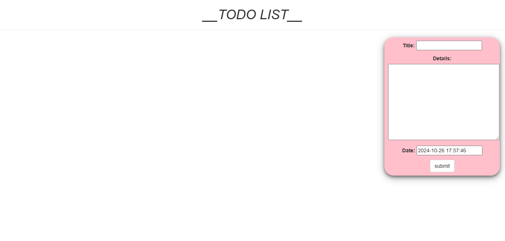
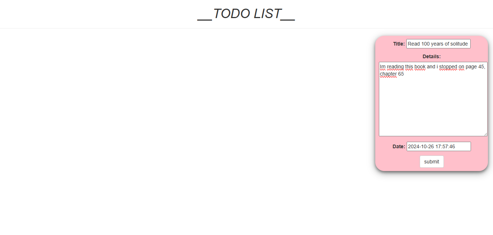
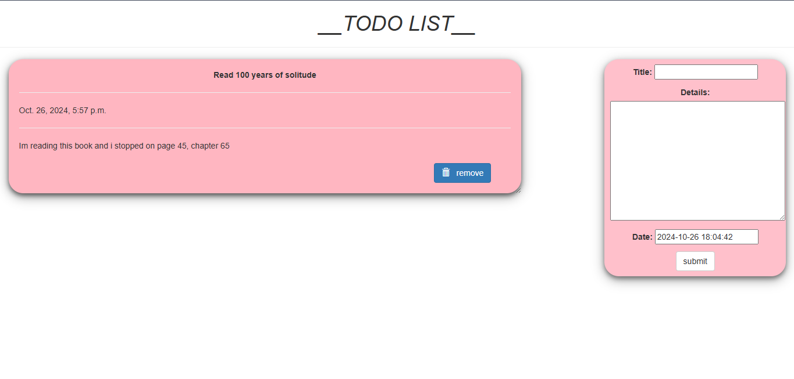
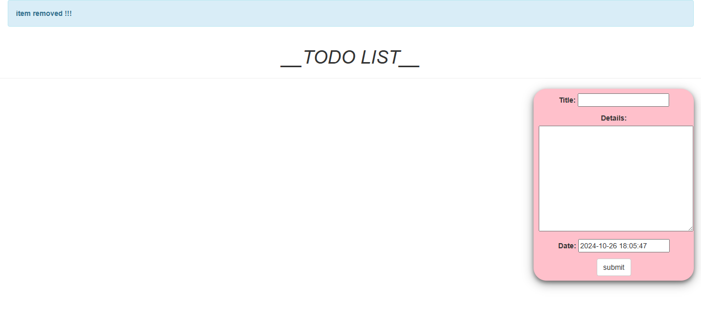
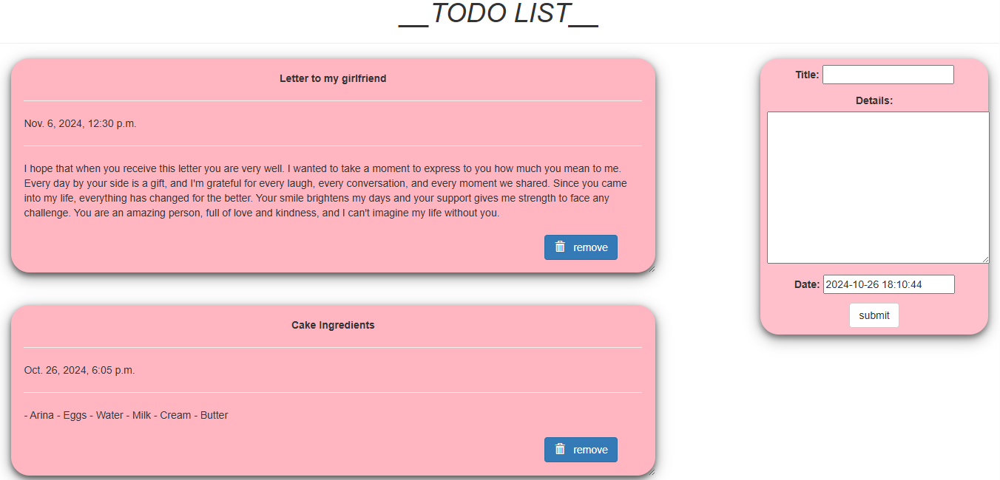

# Django Todo Webapp

## Overview

This is a simple Todo Webapp built using Django. It allows users to create, view, and delete tasks from their todo list. The app uses Django's built-in ORM for database interactions and crispy-forms for better form rendering.

## Features

- Add new tasks with title and details.
- View all tasks in a list with their creation date.
- Delete tasks when completed.
- Responsive design with Bootstrap.

## Technologies Used

- Python 3.12
- Django 5.1
- Bootstrap 3.3.7
- Gunicorn (for production deployment)

## Setup and Installation

### Prerequisites

- Python 3.12
- Docker (for containerization)
- Git (optional, for cloning the repository)

### Running the App Locally

1. **Clone the Repository**

   ```bash
   git clone https://github.com/jelambrar96-python/django-awesome-projects.git
   cd django-awesome-projects/project_001_todo_webapp
   ```

2. **Create a Virtual Environment and Activate It**

   ```bash
   python -m venv venv
   source venv/bin/activate  # On Windows use `venv\Scripts\activate`
   ```

3. **Install the Dependencies**

   ```bash
   pip install -r requirements.txt
   ```

4. **Run Migrations**

   ```bash
   python manage.py migrate
   ```

5. **Run the Development Server**

   ```bash
   python manage.py runserver
   ```

   The app will be available at `http://127.0.0.1:8000/`.

### Running the App with Docker

1. **Build the Docker Image**

   ```bash
   docker build -t django-todo-app .
   ```

2. **Run the Docker Container**

   ```bash
   docker run -d -p 8000:8000 django-todo-app
   ```

   The app will be accessible at `http://localhost:8000/`.

## Project Structure

```
project_001_todo_webapp/
│
├── todo/
│   ├── migrations/
│   ├── templates/
│   │   └── todo/
│   │       └── index.html
│   ├── __init__.py
│   ├── admin.py
│   ├── apps.py
│   ├── forms.py
│   ├── models.py
│   ├── tests.py
│   └── views.py
│
├── todo_webapp/
│   ├── __init__.py
│   ├── asgi.py
│   ├── settings.py
│   ├── urls.py
│   └── wsgi.py
│
├── manage.py
├── requirements.txt
└── Dockerfile
```

## Deployment

### Production with Gunicorn

For production deployment, it's recommended to use Gunicorn as the WSGI HTTP Server:

1. **Install Gunicorn**

   Make sure it's listed in your `requirements.txt`.

   ```bash
   pip install gunicorn
   ```

2. **Run Gunicorn**

   ```bash
   gunicorn --bind 0.0.0.0:8000 todo_webapp.wsgi:application
   ```

## user manual

This would be a general view of the page when running:



We test the functioning of the page.

First we will add a task and we give it submit:



The task will be added to the list:



If you want you can remove it:


and the task is removed:



Finally we would like to conclude that multiple tasks can be added:



### Note

Make sure to configure the `ALLOWED_HOSTS` in `settings.py` when deploying to production.

## Contributing

1. Fork the repository.
2. Create a new branch (`git checkout -b feature-branch`).
3. Commit your changes (`git commit -am 'Add some feature'`).
4. Push to the branch (`git push origin feature-branch`).
5. Create a new Pull Request.

## License

This project is licensed under the MIT License. See the [LICENSE](LICENSE) file for details.

## Acknowledgments

- [Django Documentation](https://docs.djangoproject.com/)
- [Bootstrap](https://getbootstrap.com/)
```

### Key Points Covered:

- **Overview:** A brief introduction to the project.
- **Features:** A list of functionalities provided by the application.
- **Technologies Used:** Tools and technologies used in the project.
- **Setup and Installation:** Detailed steps on how to set up and run the project locally, and using Docker.
- **Project Structure:** A quick glance at the project directory structure.
- **Deployment:** Instructions for deploying the application in a production environment.
- **Contributing:** Guidelines for contributing to the project.
- **License:** Licensing information.
- **Acknowledgments:** Resources and tools that helped in the development.
