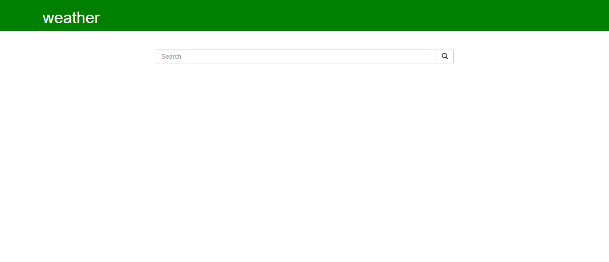
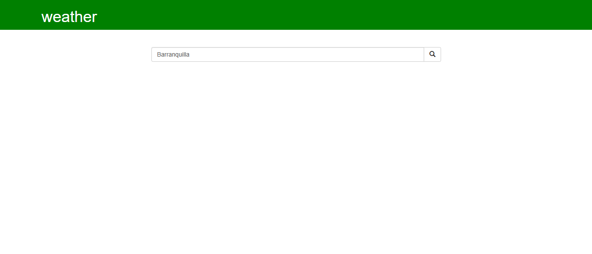

# Weather App using Django | Python

## Overview
This project is a simple **Weather App** developed using the **Django** web framework. The app allows users to check the weather of a specific city by fetching data from the **OpenWeatherMap API**. The app takes the city name as input and displays various weather details such as temperature, pressure, humidity, and the geographical coordinates of the city.

## Features
- Fetches real-time weather data from the OpenWeatherMap API.
- Displays temperature, pressure, humidity, and geographic coordinates for the entered city.
- User-friendly interface created using Django templates.

## Prerequisites
Before running the project, ensure you have the following installed:
- Python (version 3.x)
- Django (version 3.x or later)
- API Key from [OpenWeatherMap](https://openweathermap.org/) (required to fetch weather data)

## Setup Instructions

### Step 1: Clone the Project
Clone the project repository or create a new Django project.

```bash
git clone https://github.com/jelambrar96-python/django-awesome-projects
cd django-awesome-projects/project_002_weather_app
```

### Step 2: Install Dependencies
Create a virtual environment and install the required dependencies.
```bash
python -m venv env
source env/bin/activate  # For Linux/Mac
env\Scripts\activate  # For Windows
pip install -r requirements.txt
```

### Step 3: Create .env file

Create a `.env` file of te root dir of project, this is a example:

```bash
# OpenWeather API Key
OPENWEATHER_API_KEY="your_openweather_api_key_here"

# Django Secret Key
DJANGO_SECRET_KEY="your_django_secret_key"

# Django Debug Mode: True or False
DJANGO_DEBUG=True
```
### Create django secret key

```bash
python3 -c "from django.core.management.utils import get_random_secret_key; print(get_random_secret_key())"
```

### Step 5: Directory Structure
Ensure that the folder structure of the project looks like this:

```
project_002_weather_app
├── Dockerfile
├── README.md
├── main
│   ├── __init__.py
│   ├── admin.py
│   ├── apps.py
│   ├── migrations
│   │   └── __init__.py
│   ├── models.py
│   ├── templates
│   │   └── main
│   │       └── index.html
│   ├── tests.py
│   ├── urls.py
│   └── views.py
├── manage.py
├── requirements.txt
├── .env
├── run.sh
├── test_api
│   └── test_openweather_api.py
└── weather
    ├── __init__.py
    ├── asgi.py
    ├── settings.py
    ├── urls.py
    └── wsgi.py
```

Check location of your `.env` file

### Step 10: Run Migrations
Before running the project, make sure to apply the migrations:
```bash
python manage.py makemigrations
python manage.py migrate
```

### Step 11: Run the Server
Start the Django development server again:
```bash
python manage.py runserver
```

Visit `http://127.0.0.1:8000/` to view and interact with the Weather App.


## user manual

This would be a general view of the page when running:



We test the functioning of the page.

First you will be able to search for a city:



In the search you can see:
 - country code
 - Coordenate
 - temp
 - pressure
 - humidity


And you can do other searches:


Finally, all searches are saved:


## Credits
This project is based on the tutorial "[Weather App using Django | Python](https://www.geeksforgeeks.org/weather-app-using-django-python/)" by GeeksforGeeks.

## License
This project is licensed under the MIT License.
